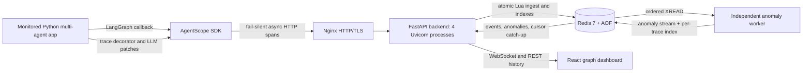
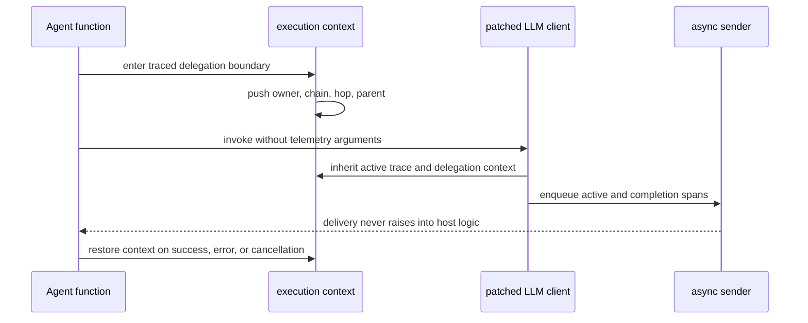
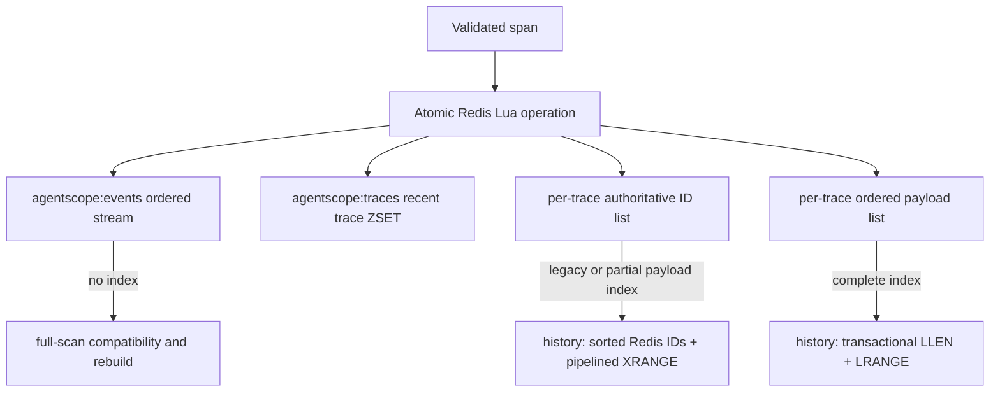

# AgentScope — Complete Project Overview

## 1. Purpose and research contribution

AgentScope is a local-first, self-hosted observability and deterministic anomaly-detection system for Python multi-agent applications. It captures an agent run as ordered spans, renders the evolving delegation/execution graph, evaluates six failure signatures, and replays persisted traces through the same dashboard path.

Its bounded novelty claim is the integrated framework-free path: execution-scoped owner and delegation context crosses `@trace` decorator and supported runtime LLM-client-patch boundaries; the resulting hierarchy is available to a live detector/graph pipeline; and failure-loop equality remains useful under opt-in client-side redaction through a process-local HMAC fingerprint. Tracing, graphs, self-hosting, redaction, and anomaly rules are not claimed as individually novel.

AgentScope detects and explains. It never terminates, retries, blocks, or otherwise remediates the monitored application.

## 2. Technology stack

| Layer | Technology | Repository role |
|---|---|---|
| Instrumentation | Python 3.9+, Pydantic 2, HTTPX, `contextvars` | Canonical span model, decorator, OpenAI/Anthropic patching, LangGraph callback adapter, fail-silent async sender |
| API | FastAPI 0.141.1, Uvicorn 0.52.4, redis-py 8.1.0 | API-key validation, ingest, trace/history reads, WebSocket relay |
| Ordered store | Redis 7 Streams, lists, sorted set, AOF | Durable event/anomaly logs, trace indexes, payload indexes, cursors, worker checkpoint |
| Detection | Python worker, Pydantic 2, redis-py 8.1.0 | Independently restartable six-rule evaluator and anomaly index migration |
| Dashboard | React 19, TypeScript 6, Vite 8, React Flow 12, dagre 3 | Live/historical graph, inspection panel, anomaly and redaction states |
| Edge/deployment | Docker Compose, Nginx, TLS | Four-process backend, worker, Redis, HTTP/HTTPS and WebSocket proxy |
| Quality/evaluation | pytest, oxlint, Playwright/axe, Locust, bootstrap/t intervals | Correctness, accessibility, fault injection, latency, and three-way comparison |
| CI | GitHub Actions, Python 3.11, Node 24, Redis service | Full SDK/backend/worker/demo suites plus dashboard build/lint and stack smoke test |

Versions above are the current declared direct versions or minimums. Container images are digest-pinned for Redis; comparison artifacts additionally pin Langfuse and Phoenix versions/images.

## 3. Architecture

The SDK is deliberately outside the service stack because it runs inside the observed application. The anomaly worker is not on the ingestion critical path; stopping it does not stop span acceptance, and it resumes from a Redis stream checkpoint.

## 4. Instrumentation and context propagation

There are two schema-identical integration flows:

1. `LangGraphAdapter` attaches as a callback and converts graph/node lifecycle events into AgentScope spans without rewriting node business logic.
2. Framework-free applications declare agent/tool boundaries with `@agentscope.trace` and optionally patch supported OpenAI or Anthropic clients. Python `contextvars` propagate trace ID, active parent span, current owner, ordered delegation chain, and hop number into nested patched calls, including asynchronous concurrent chains.

The canonical `Span` includes trace/span/parent identity, one of four span types, name, input/output, times, status/exception, token usage, agent ID, delegation chain, hop number, and an optional progress fingerprint. The schema lives only in `sdk/agentscope/schema.py`.

## 5. Persistence, ordering, and reconnect behavior

Ingest executes one Redis Lua operation. It appends the JSON span to `agentscope:events`, updates the recent-trace sorted set, appends the Redis stream ID to `agentscope:trace:<trace_id>`, and—when the index is complete—appends the same payload to `agentscope:trace-payload:<trace_id>`.

This design keeps history ordering authoritative across multiple backend processes and avoids one Redis command per event for complete new traces. It intentionally duplicates payload data: the measured latency improvement trades additional Redis memory for fewer round trips. Legacy and partial indexes never return a suffix as a complete trace.

The worker atomically writes each anomaly to the global anomaly stream and a per-trace anomaly payload list. A one-time readiness marker makes “no per-trace anomalies” an indexed negative lookup after legacy migration.

Every WebSocket frame carries the latest event and anomaly stream cursors. A reconnect supplies both IDs and receives retained entries after them before continuing live reads. Long-disconnection behavior after stream trimming or invalid cursors is not yet specified.

Backend Redis clients use a one-second health check and five bounded exponential reconnect retries (50 ms base, 500 ms cap). Calls made while Redis is actually unavailable can still fail, and retry ambiguity for a non-idempotent command is not treated as impossible.

## 6. Anomaly rules

| Rule | Current trigger |
|---|---|
| Crashes | Error-status span |
| Failure Loops | At least four repeated progress signatures within 60 s per `(trace_id, agent_id)`, deduplicated by lifecycle `span_id` |
| Timeouts | Span duration above 30 s |
| Token Spikes | More than 8,000 tokens in one call or 20,000 cumulative tokens/minute |
| Message Storms | At least 20 events within 5 s |
| Delegation Cycles | Repeated agent in the ordered delegation chain |

These thresholds are production parameters validated against the frozen synthetic corpus. Perfect scores on that corpus do not imply perfect field accuracy.

## 7. Privacy and security model

Redaction is opt-in and runs inside the monitored process before serialization. Raw `input` and `output` become `[REDACTED]`. Immediately beforehand, the SDK computes a truncated HMAC-SHA256 progress fingerprint with a process-local key. Failure Loops compares the fingerprint, retaining same-versus-changed evidence without transmitting the raw value or key. Equality within a process is intentionally leaked to the detector; fingerprints are not stable across restarts.

Nginx exposes HTTP and local self-signed TLS endpoints, while ingestion requires a configured API key. The current evidence covers key rejection, local TLS, and selected wire-level redaction boundaries. It is not a formal security/privacy proof or an independent penetration test.

## 8. API and user experience

| Surface | Behavior |
|---|---|
| `POST /ingest` | Validate canonical span, require API key, atomically persist/index, return accepted span ID |
| `GET /traces` | Most-recently active trace IDs |
| `GET /history/{trace_id}` | Ordered spans plus ordered anomaly flags, with derived trace status/times |
| `GET /ws` | Live events/anomalies; optional `last_event_id` and `last_anomaly_id` catch-up cursors |

The dashboard has Live and Historical Replay modes backed by the same graph component. Nodes expose active/success/error/anomalous states using glyph, border, and color; keyboard focus opens the inspect panel; a redaction badge surfaces scrubbed payloads. Automated accessibility evidence found zero axe violations and Lighthouse accessibility 100 on the recorded local run, but no assistive-technology participant study has been conducted.

## 9. Validation and CI inventory

The current local CI-equivalent inventory is 30 SDK tests, 18 backend tests, 4 worker tests, 1 custom-demo integration test, 1 LangGraph-demo integration test, and 6 support-triage deterministic tests. Dashboard production build and blocking lint pass. The smoke test uses externally managed Redis DB 14 and starts isolated backend/worker processes to validate ingest → persistence → WebSocket → anomaly flow.

GitHub Actions now provisions Redis explicitly, installs all runtime/demo dependencies, invokes pytest through the active Python interpreter, and treats dashboard lint as blocking. This removes the clean-Linux import-path failure and the old smoke-test collision with an already running Compose stack.

## 10. Consolidated research results

### 10.1 Delegation fidelity and privacy ablation

| Study | Result | Boundary |
|---|---|---|
| Framework-free delegation | 107/107 exact cases, including 100 concurrent chains and restoration on exception/cancellation | Deterministic Python fixtures |
| Full-capture loop detection | 100 TP, 100 TN | Balanced synthetic ablation |
| HMAC-redacted loop detection | 100 TP, 100 TN; no raw sentinel in wire object | Mechanism test, not formal privacy |
| Literal-only redaction | 100 TP, 0 TN, 100 FP | Demonstrates placeholder-equality failure |

### 10.2 Held-out anomaly comparison

Each rule received 50 positive and 50 negative held-out synthetic cases: every rule produced 50 TP, 50 TN, 0 FP, and 0 FN (precision/recall/F1 1.000; Wilson 95% interval 0.929–1.000 for precision and recall). Failure Loops rose from pre-fix precision 0.714/F1 0.833 after cross-trace isolation and lifecycle deduplication. This is synthetic-corpus accuracy, not a field-prevalence estimate.

### 10.3 Latency profile and payload-index comparison

Protocol: three fresh-volume 50-user repetitions per candidate, 75 seconds of mixed traffic, and 300 probes paced across 60 seconds.

| Candidate | Run event p95 values | Mean event p95 | Mean HTTP p95 | Mean throughput |
|---|---|---:|---:|---:|
| Pre-index `dadf573` | 219.75, 656.80, 250.75 ms | 375.77 ms | 366.67 ms | 267.52 req/s |
| Payload index `7f89f34` | 125.00, 156.80, 125.00 ms | **135.60 ms** | **140.00 ms** | **380.79 req/s** |

All three post-index runs met the local <200 ms event p95 target. Sequential associated changes were −63.9% event p95, −61.8% HTTP p95, and +42.3% throughput. Post-run Redis peak memory was 29.3–35.8 MB while more requests were processed, versus 12.9–22.1 MB before. The design was sequential, not randomized interleaved; it does not isolate a universal causal effect.

### 10.4 Latest three-way comparison

Protocol: three fresh processes/storage stacks per product; 30 measured pairs per workload/process after five warm-ups; no outlier removal; 210/210 expected traces visible per product. Intervals are Student t 95% intervals across three process means.

| Product | CPU-trivial overhead | Delta | 100 ms/node overhead | Delta |
|---|---:|---:|---:|---:|
| AgentScope | 68.92% (39.16–98.69) | 2.230 ms | 4.81% (1.28–8.33) | 10.155 ms |
| Langfuse | 235.36% (107.58–363.13) | 5.631 ms | 5.24% (0.54–9.93) | 10.848 ms |
| Phoenix | 647.78% (-283.51–1579.07) | 15.545 ms | 6.56% (4.33–8.79) | 13.551 ms |

CPU-trivial percentages divide by millisecond baselines and are unstable. The more interpretable 100 ms/node intervals overlap substantially, so the data does not establish a reliable product ranking or an unconditional AgentScope <5% result.

| Product | Process CPU | Peak process RSS | Host network | Post-flush visibility | Native query p95 |
|---|---:|---:|---:|---:|---:|
| AgentScope | 27.15 s | 97.3 MB | 0.152 MB | 280.50 ms | 57.73 ms |
| Langfuse | 18.36 s | 124.1 MB | 0.157 MB | 648.00 ms | 176.43 ms |
| Phoenix | 18.79 s | 109.4 MB | 0.293 MB | 739.12 ms | 49.36 ms |

Process resource measurements exclude product servers, network counters are host-wide, query endpoints are not semantically identical, and visibility is batch-level after flush. These are operational observations, not an overall product-quality comparison.

### 10.5 Ordering and resilience

| Scenario | Observation |
|---|---|
| Continuous live/history convergence | 9/9 burst runs matched multiset, exact order, and latest state |
| WebSocket reconnect | 20/20 expected lifecycle events, exact order, history convergence |
| Redis restart | 20 events before + 20 after; 40 final; approximately 1 s ready-state recovery; zero post-restart transient failures |
| Worker restart | 70 accepted events caught up from checkpoint |
| Backend termination | Host application succeeded in 30/30 bounded workloads |
| Slow WebSocket | Ingest baseline 50/53 ms p50/p95 versus 52/55 ms stalled |

The results are bounded to their fault protocols and retained Redis state. They do not prove survival of permanent storage loss or expired cursors.

## 11. Evidence map and reproducibility

| Evidence | Location |
|---|---|
| Latest three-way comparison and load replication | `manuscript/evaluation-artifacts/2026-09-02-replicated/` |
| Redis/history bottleneck profile | `manuscript/evaluation-artifacts/2026-09-03-redis-recovery-load/` |
| Payload-index post-rerun and before/after aggregate | `manuscript/evaluation-artifacts/2026-09-03-history-payload-index/` |
| Post-fix anomaly/convergence evidence | `manuscript/evaluation-artifacts/2026-08-31-post-fix/` |
| Delegation/privacy studies | `manuscript/evaluation-artifacts/2026-08-30-current-build/` |
| Human-study protocol and blank data sheet | `manuscript/usability-study/` |

Each quantitative directory contains raw samples or trial records, an aggregate JSON/CSV, a readable results file, generated figures where applicable, and a manifest. `manuscript/evaluation-results.md` is the paper-oriented concise synthesis; `manuscript/rigorous_evaluation_and_results_guide.md` records the full evaluation logic and remaining gates.

## 12. Current limitations and remaining work

- Run an unfamiliar-human, consented, counterbalanced diagnostic usability study; no participant outcome is currently claimed.
- Define and test reconnect behavior when stream cursors have been trimmed or become invalid.
- Repeat comparisons with product server containers included in resource isolation and with more independent process/host repetitions.
- Validate detectors on representative external workloads and field prevalence rather than only a balanced synthetic corpus.
- Add cloud evidence only if a reference deployment is actually executed and archived.
- Complete bibliography metadata/access-date review and a documentation-derived qualitative feature matrix.

These limitations are research boundaries, not hidden failures. Historical artifacts remain preserved so changes in results can be traced rather than overwritten.
